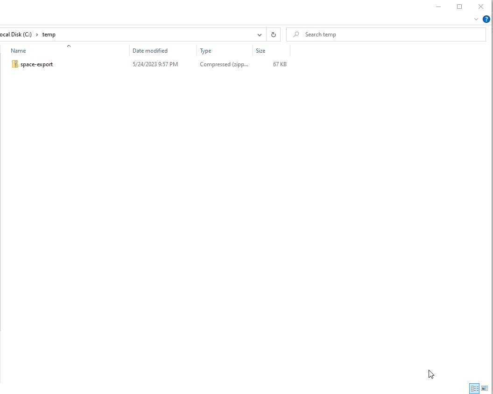

# Confluence To Obsidian

This plugin imports [Confluence](https://www.atlassian.com/software/confluence) space exported as HTML into [Obsidian](https://obsidian.md) vault.

> **NOTE**
> - The plugin is currently WIP, so use it on your own risk
> - Works only on desktop and tested only on Windows
> - Under the hood the plugin uses [confluence-to-markdown](https://github.com/KkEi34/confluence-to-markdown)

# Requirements
You must have [pandoc](http://pandoc.org/installing.html) command line tool installed.

# How to use
1. Export Confluence space as HTML
   - **Confluence Server**
     - Open space
     - Select **Space Tools** | **Content Tools** | **Export** 
     - Select **HTML** as export format and click **Next>>**
     - In **Export HTML Options** choose **Normal** or **Custom** export and click **Export**
     - Download `zip` file
   - **Confluence Cloud**
     - Open space
     - Select **Space Settings**, in **Manage space** group select "Export space"
     - Select **HTML** as export format and click **Next>>**
     - In **Export HTML Options** choose Normal or Custom export and click **Export**
     - Download `zip` file
 2. Import Space in Obsidian
    - Extract zip file
    - In Obsidian command palette select **Confluence to Obsidian: Import Confluence space** command
    - In **Space directory** of **Import Confluence space** dialog provide path to the confluence space folder, extracted from `zip` file and click **Import**

